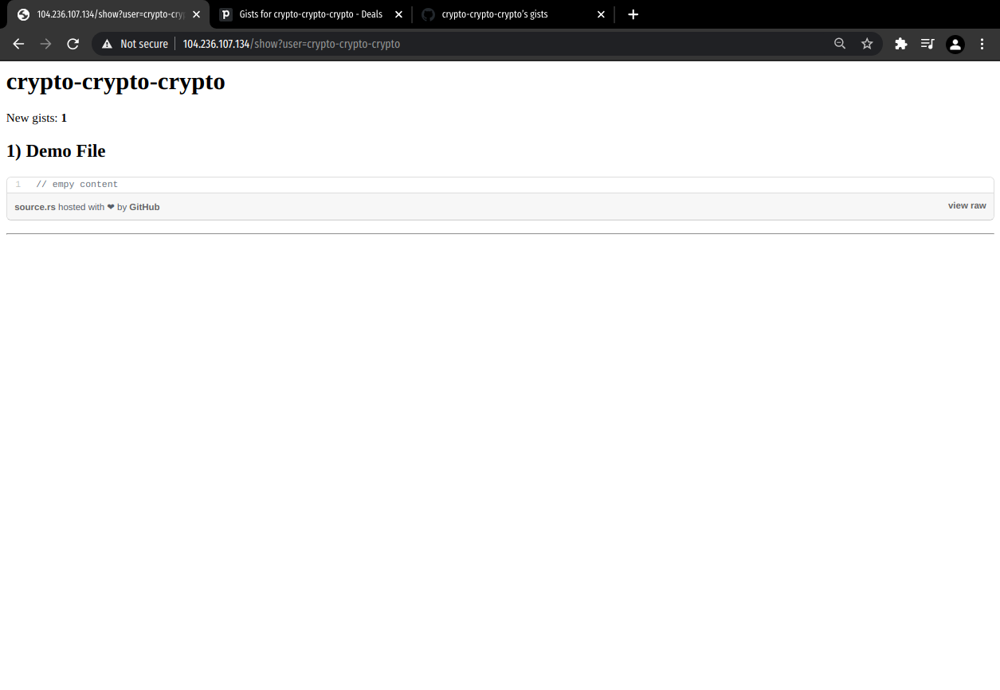

# Pipedrive Task

## Description

This application syncs Github users' gists with Pipedrive. It provides a minimal interface and endpoints to show and perform data states.
For this, the user has to specify the Github users to be tracked. The application synchronizes the dataset of users with Pipedrive's suitable entities. In this way, Pipedrive serves as a database and we avoid using intermediate databases.

## Try it out!
- [104.236.100.141](104.236.107.134) Application
  - Example for adding a user: http://104.236.107.134/new?user=crypto-crypto-crypto
  - Example for showing updates: http://104.236.107.134/show?user=crypto-crypto-crypto
  - Example for listing tracked users: http://104.236.107.134/list
- [104.236.100.141:9090](http://104.236.100.141:9090/targets) Prometheus Server
- [104.236.100.141:3000](http://104.236.100.141:3000/d/URKjoHXGz/pipedrive-gists?orgId=1&refresh=2h&from=now-24h&to=now) Grafana Dashboard
* If user/password is required: user: admin, password: admin

### Technology
This project uses the following list of technologies:
- Node.js (for main source code)
- Docker (for execution runtime/deployment, resiliency, scalability)
- Prometheus (for monitoring)
- Grafana (for visualization)
- Github Actions (for CI/CD)
- Digital Ocean (for cloud provider services)
- Github, Pipedrive Rest API (for fetching/storing data)
- Docker Machine (for provisioning)
- Docker Hub (for container registry)

### Flow of execution and assumptions
- The user adds a new username to the program. Every new user is created in pipedrive as a __Contact__. The program also creates a __Deal__ under the name "Gists for {username}" within the __Organization__ called "GITHUB_GISTS" (This avoids overlaping with current Deals). The newly created __Deal__ will keep Github user's gists as Pipedrive's __Activities__. Every activity will carry the id of the gist as its description.
- When the user hits the `/show` endpoint, these gists will be marked as "seen" so the user won't see the same activities when it refreshes the page. In pipedrive terms, this activity (gist) is marked as done. In this way we make the seen/unseen logic using the "done" field. We also use the field "note" of the activity to hold the "id" of the gist.
- In background, the program will keep the Pipedrive database synchronized with the users' gists by performing repeated calls to `/fetch` in an interval of 5 seconds. The program will only add activities that differ from the user's unseen gists.

### Endpoints
- `GET /list` Retrieves the list of users being tracked, in JSON format.
- `GET /new?user={github_username}` Adds the user to the list of users to be tracked.
- `GET /show?user={github_username}` Displays the last (unseen) updates of gist from a specific user.
- `GET /fetch` Synchronizes the new users' gists with the Pipedrive database.
- `GET /metrics` Reports the health of the system (used by the monitoring tool).

### Demo
- Add a user

- Gists of user (in Pipedrive as Deals)


- Gists of user (in application)

- The next time we run it we won't see the same notifications because they have been cleared up.

- The activities haven been updated in pipedrive

- We add a new gist of user

- We receive the new gist in our application

- List tracked users


## Development

### Pre-requisites
- Get the tokens
  - Obtain the tokens for Github, Pipedrive
- Install node, docker, git

Clone the repository

```bash
$ git clone https://github.com/crypto-crypto-crypto/pipedrive-task.git
$ cd pipedrive-task
```

There are two ways to run the code for development: in the same system or with docker.

### Alternative 1: Run the code locally in the same host system

```bash
$ yarn install # or npm install
$ export API_TOKEN_PIPEDRIVE={TOKEN_HERE}
$ export API_TOKEN_GITHUB={TOKEN_HERE}
$ yarn start # or npm run start, or node server.js
```

### Alternative 2: Run the code with Docker

```bash
$ docker build -t jcrm/pipedrive-task-server:latest . # change with the desired docker username/image
$ docker run \
    -e API_TOKEN_PIPEDRIVE={TOKEN_HERE} \
    -e API_TOKEN_GITHUB={TOKEN_HERE} \
    -p 8080:8080 \
    jcrm/pipedrive-task-server:latest
```

## Deploy

### Pre-requisites
- Get the tokens
  - Obtain the tokens for Digital Ocean, Docker Hub

### Fist time setup

We first need to prepare a cloud environment for the code to be deployed.
The option of choice of this implementation is Digital Ocean. We need to generate an API token in order to provision our resources programatically. Thus, avoiding the creation of our resources and dependencies manually.

For Continuous integration and delivery, this project relies on Github Workflow to execute the stages of build and deploy of our source code.
It's important to create secret variables that are going to be used in the pipeline runtime.

We also generate SSH Keys in the Digital Ocean console. Running `ssh-keygen` for the generation of a key pair and copying and pasting the public key into Digital Ocean's SSH Key panel will suffice.

Let's create our first Digital Ocean droplet with the following configuration.

```bash
$ docker-machine create \
    --digitalocean-size "s-1vcpu-1gb" \ # we create a droplet with the smallest resources
    --driver digitalocean \
    --digitalocean-ssh-key-path $(PATH_OF_PRIVATE_KEY) \ # replace PATH_OF_PRIVATE_KEY with the private key associated with the Digital Ocean SSH key
    --digitalocean-ssh-key-fingerprint $(FINGERPRINT_KEY) \ # replace FINGERPRINT_KEY with the fingeprint associated with the Digital Ocean SSH Key
    --digitalocean-access-token $(API_TOKEN) \ # replace API_TOKEN with the Digital Ocean API Token
    pipedrive-task-prod

```

NB. This project also implements a monitoring system that is deployed separately. For that we will also need to create a separate droplet instance.

```bash
$ docker-machine create \
    --digitalocean-size "s-1vcpu-1gb" \
    --driver digitalocean \
    --digitalocean-ssh-key-path $(PATH_OF_PRIVATE_KEY) \
    --digitalocean-ssh-key-fingerprint $(FINGERPRINT_KEY) \
    --digitalocean-access-token $(API_TOKEN) \
    pipedrive-task-monitor

```

We can list the instances that we have just provisioned to check that everything is alright.

```bash
$ docker-machine ls
NAME                     ACTIVE   DRIVER         STATE     URL                          SWARM   DOCKER     ERRORS
pipedrive-task-monitor   -        digitalocean   Running   tcp://104.236.100.141:2376           v20.10.6
pipedrive-task-prod      -        digitalocean   Running   tcp://104.236.100.141:2376           v20.10.6
```

Our pipeline uses sentible data (as private tokens and ssh keys). We shouldn't expose them in the configuration file. For this, we can manage them using "Github Secrets" on our repository. We have to define the following keys:

- `API_TOKEN_GITHUB`: Github API token
- `API_TOKEN_PIPEDRIVE`: Pipedrive API token
- `DOCKERHUB_TOKEN`: Dockerhub API token
- `DOCKERHUB_USERNAME`: Dockerhub username
- `HOST`: Digital ocean public IP
- `SSHKEY`: Digital ocean's private ssh key of the instance
- `USERNAME`: Digital ocean user of the instance

Now we need to deploy our source code as docker images into the newly created machines.
Automatic deployment is done via github actions through two stages: `build_and_push` and `deploy`.
The first, will build the docker image for the source code, then it will publish to a public container registry (Docker Hub in this case).
When this step is done, the action will access to the digital ocean instance via SSH, it will pull the latest image of our code and it will restart automatically. In this way we achieve push and deploy in one single pass. The complete source code for the workflow can be seen in the file [.github/workflows/pipeline.yml](https://github.com/crypto-crypto-crypto/pipedrive-task/blob/main/.github/workflows/pipeline.yml). Observe that the flag `--restart always` in docker will keep the service alive regarless of the failures. This is a simple way to achieve resiciency.


### Monitoring

The source code for the monitoring is under `/monitor`, which is a boilerplate code adepted from [stefanprodan/dockprom](https://github.com/stefanprodan/dockprom). A new job entry is needed to make prometheus fetch the health status of our program.

```bash
$ cat monitor/prometheus/prometheus.yml
...
- job_name: 'nodejs'
  scrape_interval: 10s
  honor_labels: true
  static_configs:
    - targets: ['104.236.107.134:80']
...
```

Now we start up the docker cluster with the monitoring instances by using docker-compose. 

```bash
$ cd monitor
$ docker-compose up --build -d
...
```

The application exposes an endpoint in /metrics which output looks like:
```text
http_request_duration_seconds_bucket{le="0.1",status_code="200",method="GET"} 0
http_request_duration_seconds_bucket{le="0.3",status_code="200",method="GET"} 1
http_request_duration_seconds_sum{status_code="200",method="GET"} 1847.2241373160014
up 1
```
Prometheus uses this information, stores it in a database and allows Grafana to retrieve and show in a dashboard.
This application implements a simple health check to inform whether the service is up or not.


* As an additional information, the instance is kept secure by a simple mechanism of proxy/load balancing using Nginx:
```bash
$ cat /etc/nginx/sites-available/default
server {
        listen 80 default_server;
        listen [::]:80 default_server;
        root /var/www/html;

        index index.html index.htm index.nginx-debian.html;

        server_name _;

        location / {
                proxy_pass http://localhost:8080;
                proxy_http_version 1.1;
                proxy_set_header Upgrade $http_upgrade;
                proxy_set_header Connection 'upgrade';
                proxy_set_header Host $host;
                proxy_cache_bypass $http_upgrade;
        }

}
```

### Additional Screenshots
- Digital Ocean Droplets


## Afterthoughts

Initially I estimated the development of the application for a total of 10 hours in the following breakdown of tasks.
- [x] Write and outline plan of action. setup repo, boilerplate code - 1h
- [x] Code first part, make api calls with github/pipedrive api - 1h
- [x] Implement part I - 3h
  - [x] endpoint for retrieving info and saving in pipedrive
  - [x] implement views
  - [x] implement logging
- [x] Implement part II - 3h
  - [x] deploy via single dockerfile
  - [x] deploy monitoring service
- [x] Write README, report of features, time - 2h

However, it ended up with 23 hours, and this was the realistic time.
- [x] Write and outline plan of action. setup repo, boilerplate code - 1h
- [x] Code first part, make api calls with github/pipedrive api - 2h
- [x] Implement part I - 7h
- [x] Implement part II - 10h
- [x] Write README, report of features, time - 3h

We can see that the implementation of the part II demanded the longest time. My take aways of the estimation vs reality give me the following possible reasons:
- Figure out how to integrate APIs and keep them on sync (plus user interaction of seen/unseen feature).
- Implementing the features with the APIs in a way that we don't keep states locally or in a external database.
- It was the first time using Github Actions, so it was a process of multiple trial and errors.
- Getting the monitoring service and the application work together was tricky at first.

## References

- https://developers.pipedrive.com/docs/api/v1/#!/Activities/getActivity
- https://github.com/crypto-crypto-crypto/client-nodejs#persons_controller
- https://docs.github.com/en/rest/reference/gists#list-gists-for-a-user
- https://github.com/stefanprodan/dockprom
- https://medium.com/teamzerolabs/node-js-monitoring-with-prometheus-grafana-3056362ccb80
- https://codersociety.com/blog/articles/nodejs-application-monitoring-with-prometheus-and-grafana
- https://community.tibco.com/wiki/monitoring-your-nodejs-apps-prometheus
- https://docs.github.com/en/actions/learn-github-actions/managing-complex-workflows

> Carlos Ramos, 13th April 2021